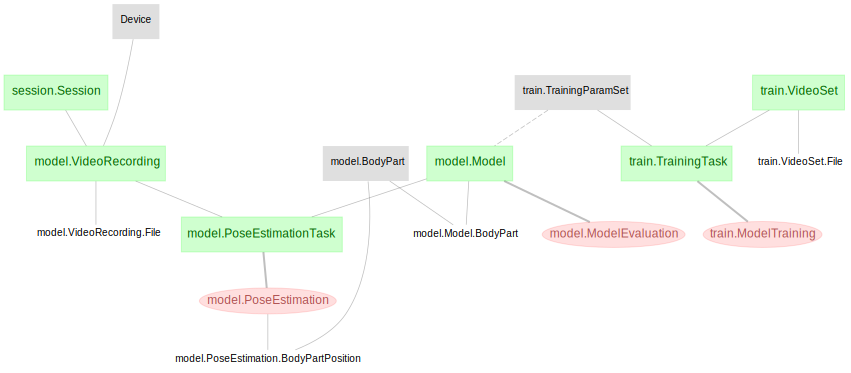

# DataJoint Element - DeepLabCut

This repository features a DataJoint schema for pose estimation via ***DeepLabCut***.
The pipeline presented here is not a complete pipeline by itself, but rather a modular
design of tables and dependencies specific to the behavior tracking workflow. This
modular pipeline element can be flexibly attached downstream to any particular design
of experiment session, thus assembling a fully functional behavior pipeline (see the
example [workflow-deeplabcut](https://github.com/datajoint/workflow-deeplabcut)).

This Element currently supports single-animal, single-camera 2D models, and does not yet
support multi-animal or multi-camera models. This Element does not offer any features
for labeling training data. Users should to use native DeepLabCut tools for
intitializing a project and labeling training data.

## The Pipeline Architecture



As the diagram depicts, the DeepLabCut element starts immediately downstream from
a ***Session*** table, which is modeled in our 
[workflow pipeline](https://github.com/datajoint/workflow-deeplabcut/blob/main/workflow_deeplabcut/pipeline.py).
The following tables are further downstream across two schemas:

- `train` schema: Tables related to model training.
   + ***VideoSet***: The set of files corresponding to a training dataset.
   + ***TrainingParamSet***: A collection of model training parameters, represented by an index.
   + ***TrainingTask***: A set of tasks specifying model training methods.
   + ***ModelTraining***: A record of training iterations launched by ***TrainingTask***.
- `model` schema: Tables related to DeepLabCut models and pose estimation.
   + ***VideoRecording***: Video(s) from one recording session, for pose estimation.
   + ***BodyPart***: Unique body parts (a.k.a. joints) and descriptions thereof.
   + ***Model***: A central table for storing unique models.
   + ***ModelEvaluation***: Evaluation results for each model.
   + ***PoseEstimationTask***: A series of pose estimation tasks to be completed. 
     Pairings of video recordings with models to be use for pose estimation.
   + ***PoseEstimation***: Results of pose estimation using a given model. 

## Installation

+ Install `element-deeplabcut`
    ```
    pip install element-deeplabcut
    ```

+ Upgrade `element-deeplabcut` previously installed with `pip`
    ```
    pip install --upgrade element-deeplabcut
    ```

+ Install `element-interface`

    + `element-interface` is a dependency of `element-deeplabcut`, however it is not
      contained within `requirements.txt`.

    ```
    pip install "element-interface @ git+https://github.com/datajoint/element-interface"
    ```

## Usage

### Element activation

To activate the `element-deeplabcut`, one needs to provide:

1. Schema names
    + optionally, a schema name for the `train` module.
    + a schema name for the `model` moduel.
2. Upstream tables
    + `Session`: A set of keys identifying a recording session (see 
      [Element-Session](https://github.com/datajoint/element-session)).
    + `Device`: A reference table linked `VideoRecording` to specify camera information.
3. Utility functions
    + `get_dlc_root_data_dir()` to provide a root directory for a given machine,
    + optionally, `get_dlc_processed_data_dir()` to provide an output directory.

For more detail, check the docstring of the `element-deeplabcut`:
```python
    help(train.activate)
    help(model.activate)
```
### Example usage

See [our workflow](https://github.com/datajoint/workflow-deeplabcut) for an example usage of this DeepLabCut Element.
